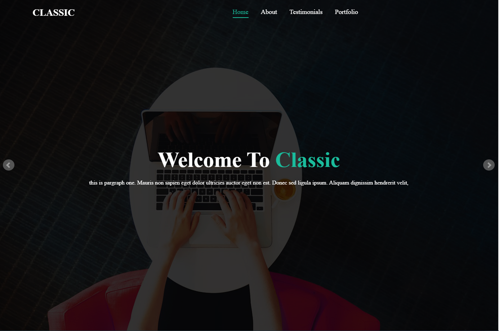
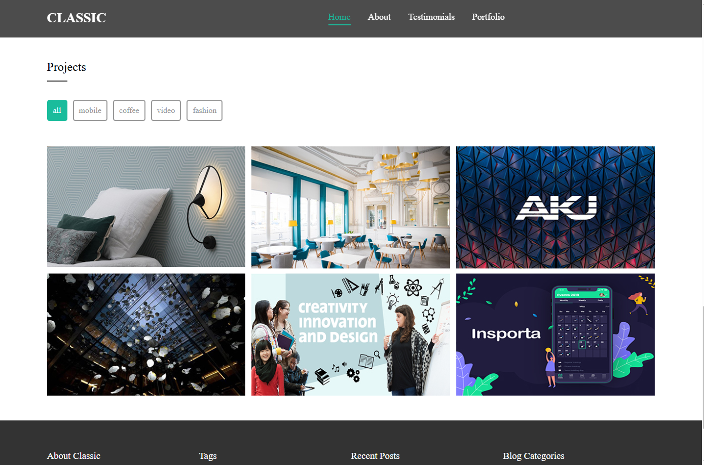

## Classic

## Personal Portfolio 💼
This is a personal portfolio website built using HTML, CSS, and JavaScript – without any frameworks.
It features a clean, responsive, and animated design to showcase personal information and projects in a professional way.

## Features 🚀

- Fully responsive layout (mobile, tablet, and desktop)

- Smooth animations for enhanced user experience

- Image/content slider

- About section to introduce yourself

- Testimonials section to display client feedback or recommendations

- Portfolio section to showcase projects or work samples

## Structure 📁
The portfolio includes the following main sections:

- Hero/Intro

- About Me

- Portfolio

- Testimonials

- Contact

## Usage
1. Clone the repository or download the project files.
2. Open `index.html` in your browser to view the project.
3. Customize the styles in `css/style.css` or add new JavaScript functionality in the `js/` folder.

## Dependencies
- [jQuery](https://jquery.com/)
- [MixItUp](https://www.kunkalabs.com/mixitup/)
- [Font Awesome](https://fontawesome.com/)

## License
This project is licensed under the MIT License. Feel free to use and modify it as needed.